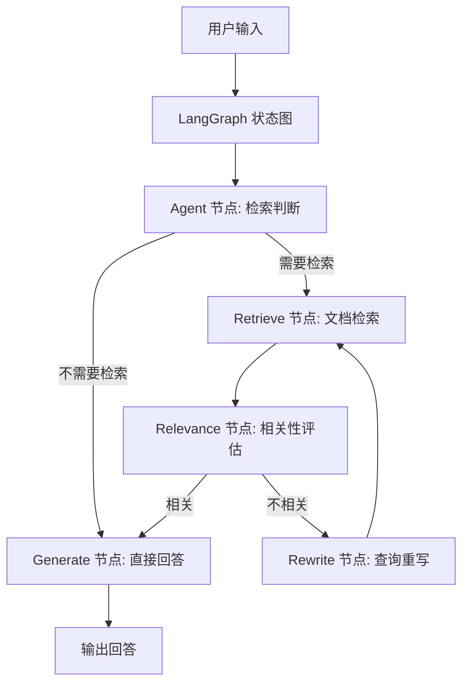

# Agentic RAG 系统改进项目 PRD 文档

## 1. 产品概览

本项目旨在基于现有 AgenticRAG 系统，通过引入 LangGraph 框架实现更智能的检索增强生成（RAG）流程，提升系统的检索准确性和回答质量。系统将实现检索判断、相关性评估和查询重写功能，以确保用户查询能够获得最相关的文档支持，从而生成更准确、更符合用户意图的回答。

**核心价值**：
- 提高检索准确性，减少不相关信息干扰
- 优化用户体验，提供更精准的回答
- 保持现有知识库构建过程不变，降低改造成本
- 模块化设计，便于后续扩展和维护

## 2. 核心功能

### 2.1 功能模块

| 模块名称 | 功能描述 | 实现方式 |
|---------|---------|---------|
| 检索判断 | 分析用户查询，判断是否需要检索文档 | LangGraph 节点，基于查询类型和关键词分析 |
| 文档检索 | 从向量存储中检索相关文档 | 复用现有向量存储服务 |
| 相关性评估 | 评估检索结果与查询的相关性 | 基于嵌入向量相似度计算 |
| 查询重写 | 当检索结果不相关时，重写查询以获得更相关的结果 | LangGraph 节点，使用 LLM 生成优化查询 |
| 回答生成 | 基于相关文档生成最终回答 | 结合检索结果和 LLM 生成 |

### 2.2 流程设计

1. **输入处理**：接收用户查询，初始化对话状态
2. **检索判断**：Agent 节点分析查询，决定是否需要检索
   - 不需要检索的情况：常识性问题、简单指令等
   - 需要检索的情况：需要文档支持的专业问题
3. **文档检索**：调用现有向量存储服务执行检索
4. **相关性评估**：
   - 计算检索结果与查询的相似度
   - 设置相关性阈值，判断是否需要重写
5. **查询重写**：
   - 基于原始查询和检索结果，生成更精确的查询
   - 重写策略：关键词扩展、语义优化、上下文补充
6. **重新检索**：使用重写后的查询再次检索
7. **回答生成**：基于相关文档生成最终回答

### 2.3 用户界面

- **输入界面**：文本输入框，用于用户输入查询
- **输出界面**：文本输出区域，显示系统生成的回答
- **状态显示**：可选，显示当前处理状态（如检索中、重写查询等）

## 3. 技术架构

### 3.1 技术栈

| 技术/框架 | 用途 | 来源 |
|---------|------|------|
| Python | 主要开发语言 | 项目代码 |
| LangGraph | 状态管理和流程控制 | clvision 虚拟环境 |
| LangChain | LLM 应用构建框架 | 项目代码 |
| Chroma | 向量数据库 | 项目代码 |
| OpenAI API | 模型调用接口 | 项目代码 |
| SiliconFlow | 模型 API 提供者 | 项目代码 |
| Qwen/Qwen3-8B | 聊天模型 | 项目代码 |
| BAAI/bge-m3 | 嵌入模型 | 项目代码 |

### 3.2 系统架构

### 3.3 核心组件

1. **LangGraph 状态图**：管理整个 RAG 流程，控制节点间的状态传递
2. **Agent 节点**：判断是否需要检索，基于查询类型和关键词分析
3. **Retrieve 节点**：集成现有向量存储服务，执行文档检索
4. **Relevance 节点**：评估检索结果与查询的相关性，计算相似度
5. **Rewrite 节点**：当检索结果不相关时，重写查询以获得更相关的结果
6. **Generate 节点**：基于相关文档生成最终回答

## 4. 实现计划

### 4.1 依赖管理

- **虚拟环境**：使用现有 clvision 虚拟环境，其中包含 LangGraph 等所需依赖
- **依赖检查**：确保虚拟环境中包含以下包：
  - langgraph
  - langchain
  - chromadb
  - langchain_openai
  - langchain_chroma

### 4.2 开发步骤

1. **状态设计**：定义系统状态结构，包含查询、检索结果、相关性评估等信息
2. **节点实现**：
   - Agent 节点：实现检索判断逻辑
   - Retrieve 节点：集成现有向量存储服务
   - Relevance 节点：实现相关性评估
   - Rewrite 节点：实现查询重写逻辑
   - Generate 节点：实现回答生成
3. **状态图构建**：定义节点间的流转逻辑，构建完整的状态图
4. **测试和优化**：调整相关性阈值、重写策略等参数
5. **集成到现有系统**：替换现有的查询处理流程

### 4.3 关键实现点

- **状态管理**：使用 LangGraph 的状态图管理整个流程，确保各节点间的状态传递
- **相关性评估**：基于嵌入向量的相似度计算，设置合理的相关性阈值
- **查询重写**：使用 LLM 生成更精确的查询，结合检索结果的上下文信息
- **多轮对话支持**：维护对话历史，基于历史上下文优化查询和回答

## 5. 测试计划

### 5.1 测试用例

| 测试场景 | 预期结果 | 测试方法 |
|---------|---------|--------|
| 不需要检索的查询 | 直接生成回答，不执行检索 | 输入常识性问题，验证是否跳过检索步骤 |
| 需要检索的查询 | 执行检索并生成基于文档的回答 | 输入需要文档支持的专业问题，验证检索结果和回答质量 |
| 检索结果相关 | 基于相关文档生成回答 | 输入明确的问题，验证检索结果的相关性和回答质量 |
| 检索结果不相关 | 重写查询并重新检索 | 输入模糊的问题，验证系统是否重写查询并获得更相关的结果 |
| 多轮对话 | 基于历史上下文生成回答 | 进行多轮对话，验证系统是否考虑历史上下文 |

### 5.2 性能测试

- **响应时间**：测量系统处理查询的响应时间，确保在可接受范围内
- **检索准确性**：评估检索结果的相关性，计算准确率
- **回答质量**：评估生成回答的准确性和相关性

## 6. 验收标准

1. **功能完整性**：所有核心功能模块正常工作，流程完整
2. **检索准确性**：检索结果与查询的相关性达到预期标准
3. **回答质量**：生成的回答准确、相关、符合用户意图
4. **性能指标**：响应时间在可接受范围内，系统稳定运行
5. **集成兼容性**：与现有知识库构建过程无缝集成，不影响现有功能

## 7. 风险评估

| 风险点 | 影响 | 缓解措施 |
|-------|------|--------|
| 查询重写效果不佳 | 可能导致检索结果仍不相关 | 优化重写策略，调整 LLM 提示词 |
| 相关性评估不准确 | 可能过滤掉相关文档或保留不相关文档 | 调整相关性阈值，优化评估算法 |
| 性能开销增加 | 引入查询重写可能增加响应时间 | 优化重写逻辑，设置合理的重写次数上限 |
| 与现有系统集成问题 | 可能影响现有功能 | 充分测试集成点，确保向后兼容 |

## 8. 总结

本项目通过引入 LangGraph 框架，实现了更智能的 Agentic RAG 系统，包含检索判断、相关性评估和查询重写功能。系统保留了现有的知识库构建过程，只优化查询处理流程，降低了改造成本。通过提高检索准确性和回答质量，系统将为用户提供更优质的问答体验。

项目计划使用现有的 clvision 虚拟环境，其中包含 LangGraph 等所需依赖，避免了重复安装依赖的工作。实现过程将遵循模块化设计原则，确保系统的可扩展性和可维护性。